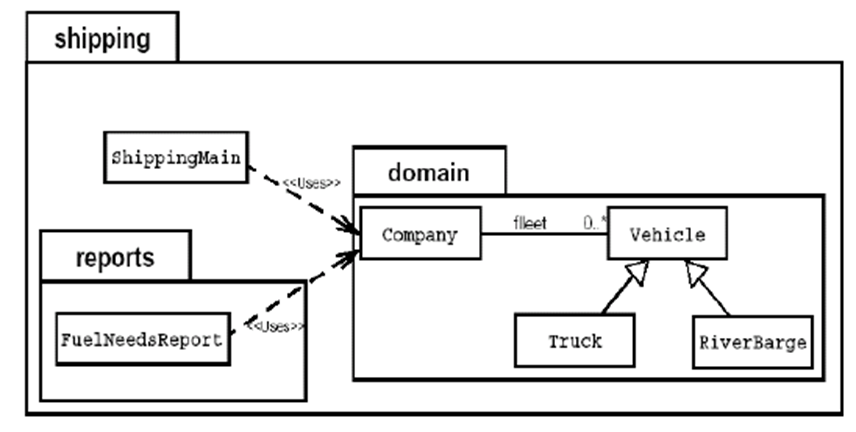

# 抽象类(abstract class)

随着继承层次中一个个新子类的定义，类变得越来越具体，而父类则更一般，更通用。类的设计应该保证父类和子类能够共享特征。有时将一个父类设计得非常抽象，以至于它没有具体的实例，这样的类叫做抽象类。

在面向对象的概念中，所有的对象都是通过类来描绘的，但是反过来，并不是所有的类都是用来描绘对象的，如果一个类中没有包含足够的信息来描绘一个具体的对象，这样的类就是抽象类。

抽象类除了不能实例化对象之外，类的其它功能依然存在，成员变量、成员方法和构造方法的访问方式和普通类一样。

由于抽象类不能实例化对象，所以抽象类必须被继承，才能被使用。也是因为这个原因，通常在设计阶段决定要不要设计抽象类。

父类包含了子类集合的常见的方法，但是由于父类本身是抽象的，所以不能使用这些方法。


用abstract关键字来修饰一个类时，这个类叫做抽象类；

用abstract来修饰一个方法时，该方法叫做抽象方法。

抽象方法：只有方法的声明，没有方法的实现。以分号结束。

```java
abstract int abstractMethod1( int a );
```

含有抽象方法的类必须被声明为抽象类。

抽象类不能被实例化。抽象类是用来被继承的，抽象类的子类必须实现~~重写~~父类的抽象方法，并提供方法体。

不能用abstract修饰私有方法，构造方法，静态方法。

```java
abstract class A{   
   abstract void m1( );
   public void m2( ){
System.out.println("A类中定义的m2方法");
   }
}

class B extends A{
   void m1( ){
System.out.println("B类中定义的m1方法");
   }
}

public class Test{
   public static void main( String args[ ] ){
A c = new B( );
c.m1( );
c.m2( );
   }
}
```

抽象类是用来模型化那些父类无法确定全部实现，而是由其子类提供具体实现的对象的类。

案例：

​	员工类中计算薪水的方法各个部门都不相同


案例：



在航运公司系统中，Vehicle类需要定义两个方法分别计算运输工具的燃料效率和行驶距离。

问题：卡车(Truck)和驳船(RiverBarge)的燃料效率和行驶距离的计算方法完全不同。Vehicle类不能提供计算方法，但子类可以。

Java允许类设计者指定：超类声明一个方法但不提供实现，该方法的实现由子类提供。

这样的方法称为抽象方法。有一个或更多抽象方法的类称为抽象类。

Vehicle是一个抽象类，有两个抽象方法。


