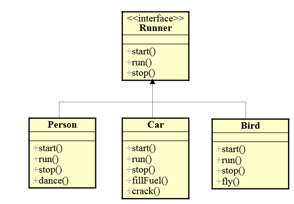
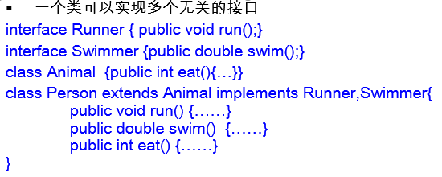
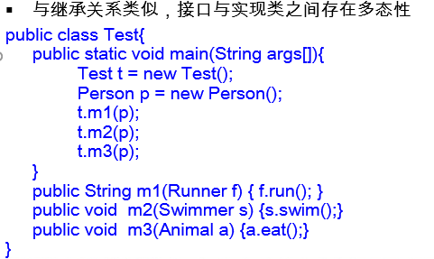

# 接口(interface)

有时必须从几个类中派生出一个子类，继承它们所有的属性和方法。但是，Java不支持多重继承。有了接口，就可以得到多重继承的效果。

接口(interface)是抽象方法和常量值的定义的集合。

从本质上讲，接口是一种特殊的抽象类，这种抽象类中只包含常量和方法的定义，而没有变量和方法的实现。

接口定义举例

public interface Runner {

int id = 1;

public void start();

public void run();

public void stop();

}

 

 

案例:

蝙蝠会飞,又会用牙齿咬

 

接口的特点：

用 interface 关键字来定义

接口中的所有成员变量都默认是由public static final修饰的。

接口中的所有方法都默认是由public abstract修饰的。

接口没有构造方法。构造方法用于创建对象

实现接口的类中必须提供接口中所有方法的具体实现内容。 

多个无关的类可以实现同一个接口

一个类可以实现多个无关的接口

与继承关系类似，接口与实现类之间存在多态性

接口也可以继承另一个接口，使用extends关键字。

定义Java类的语法格式：

< modifier> class < name> [extends < superclass>]

[implements < interface> [,< interface>]* ] {

< declarations>*

}

 

案例: 

案例:

如果实现接口的类中没有实现接口中的全部方法，必须将此类定义为抽象类。 

接口也可以继承另一个接口，使用extends关键字

interface MyInterface

{

String s=“MyInterface”;

public void absM1();

}

interface SubInterface extends MyInterface

{

public void absM2();

}

public class SubAdapter implements SubInterface

{

public void absM1(){System.out.println(“absM1”);}

public void absM2(){System.out.println(“absM2”);}

}

 

 

 JDK8新增接口中抽象方法的默认实现  使用default关键字

还可以附带static的默认实现方法

## 练习

 

定义一个接口用来实现两个对象的比较。

interface CompareObject

{

public int compareTo(Object o); 

//若返回值是 0 , 代表相等; 若为正数，代表当前对象大；负数代表当前对象小

}

定义一个Circle类。

定义一个ComparableCircle类，继承Circle类并且实现CompareObject接口。在ComparableCircle类中给出接口中方法compareTo的实现体，用来比较两个圆的半径大小。

定义一个测试类TestInterface，创建两个ComaparableCircle对象，调用compareTo方法比较两个类的半径大小。

思考：参照上述做法定义矩形类Rectangle和ComparableRectangle类，在ComparableRectangle类中给出compareTo方法的实现，比较两个矩形的面积大小。

