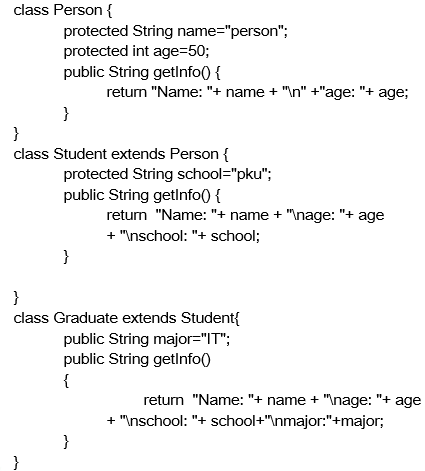

# 类型转换

## instanceof操作符

语法：x instanceof A

检验x是否为类A的对象，返回值为boolean型。

要求x所属的类与类A必须是子类和父类的关系，否则编译错误。

如果x属于类A的子类B，x instanceof A值也为true。


public class Person {…}

public class Student extends Person {…}

public class Graduate extends Student {…}

\---------------------

public void method1(Person e) {

  **if** (e instanceof Person) 

  // 处理Person类及其子类对象

  **if** (e instanceof Student) 

  //处理Student类及其子类对象

  **if** (e instanceof Graduate)

  //处理Graduate类及其子类对象

}


### 练习



建立TestInstance 类，在类中定义方法method1(Person e);

在method1中:

(1)根据e的类型调用相应类的getInfo()方法。

(2)根据e的类型执行：

如果e为Person类的对象，输出：“a person”;

如果e为Student类的对象，输出

“a student”

“a person ” 

如果e为Graduate类的对象，输出： 

“a graduated student”

“a student”

“a person” 


## 基本数据类型的Cast

小的数据类型可以自动转换成大的数据类型

如long g=20; double d=12.0f

可以把大的数据类型强制转换(casting)成小的数据类型

如 floate f=(float)12.0 int a=(int)1200L

## 引用数据类型的Cast

对Java对象的强制类型转换称为**造型**

从子类到父类的类型转换可以自动进行(隐式转换)

从父类到子类的类型转换必须通过造型(强制类型转换)实现

无继承关系的引用类型间的转换是非法的

在造型前可以使用instanceof操作符测试一个对象的类型

案例:

```java
public class Test{ 
           public void method(Person e) {  //设Person类中没有getschool()方法
      System.out.pritnln(e.getschool());   //非法,编译时错误
 
      if(e  instanceof  Student){
          Student me = (Student)e; //将e强制转换为Student类型
          System.out.pritnln(me.getschool());
      }     
           }

           public static  void main(Stirng args[]){
              Test t = new Test();
               Student m = new Student();
               t.method(m);
           }
}
```

