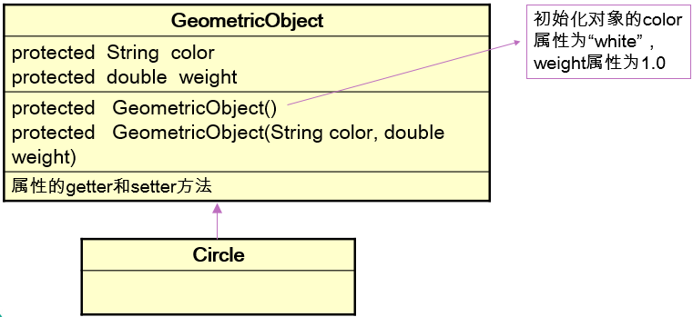
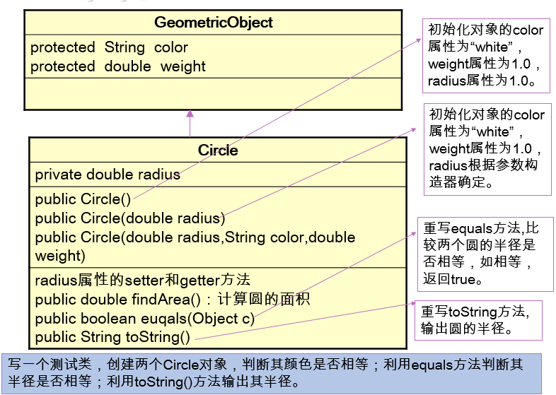

# Object类

## Object类是所有Java类的根父类

如果在类的声明中未使用extends关键字指明其父类，则默认父类为Object类 

```java
 public class Person {

  ...

  }
```

等价于：

```java
public class Person extends Object {

...

} 
```

  

案例

```
method(Object obj){…}//可以接收任何类作为其参数

Object o=new Person;  

method(o);
```

 

 

## ==操作符与equals方法

 

==操作符与equals方法的区别：

 

==：引用类型比较引用(是否指向同一个对象)；

Person p1=new Person(); Person p2=new Person();

if (p1==p2){…}

基本类型比较值；int a=5; if(a==6){…}

用"=="进行比较时，符号两边的数据类型必须一致(可自动转换的基本数据类型除外)，否则编译出错；

equals()方法是Object类的方法，由于所有类都继承Object类，也就继承了equals()方法。只能比较引用类型，其作用与“==”相同,比较是否指向同一个对象。格式:obj1.equals(obj2)

比较基本数据类型时,比较的是值是否相同

特例：当用equals()方法进行比较时，对类File、String、Date及封装类（Wrapper Class）来说，是比较类型及内容而不考虑引用的是否是同一个对象；

原因：在这些类中覆盖了equals()方法。

 

总结:

1.对于Object类而言==与equals方法是一致的,在某些Object子类(重写了equals方法) ==还是表示比较对象,而equals一般而言是用于比较值

2.==两边的数据类型要一致(除了基本数据类型的包装类)

 

 

 

 

==操作符与equals方法举例 

请给据以下代码自行定义能满足需要的MyDate类,在MyDate类中覆盖equals方法，使其判断当两个MyDate类型对象的年月日都相同是，结果为ture，否则为false。 public boolean equals(Object o)

```Java
class TestEquals {  
           public static void main(String[] args) {
         MyDate m1 = new MyDate(14, 3, 1976);
         MyDate m2 = new MyDate(14, 3, 1976);

       if ( m1 == m2 ) {
           System.out.println("m1==m2"); 
         } else {
  System.out.println("m1!=m2"); //m1 != m2
       }

       if ( m1.equals(m2) ) {
  System.out.println("m1 is equal to m2"); // m1 is equal to m2
       } else {
  System.out.println("m1 is not equal to m2");
       } 

          }
}

 

 
```

## toString 方法

 

toString()方法在Object类中定义，其返回值是String类型，返回类名和它的引用地址。

在进行String与其它类型数据的连接操作时，自动调用toString()方法

Date now=new Date();

System.out.println(“now=”+now); 

相当于 System.out.println(“now=”+now.toString());//now=Date@122345

可以根据需要在用户自定义类型中重写toString()方法

如String 类重写了toString()方法，返回字符串的值。

s1=“hello”;

System.out.println(s1);//相当于System.out.println(s1.toString());

在ToString1.java中的类A里覆盖toString方法，使其输出类A对象的cint属性值。

基本类型数据转换为String类型时，调用了对应封装类的 toString()方法int a=10; System.out.println(“a=”+a);

## 练习

•定义两个类，父类GeometricObject代表几何形状，子类Circle代表圆形。





