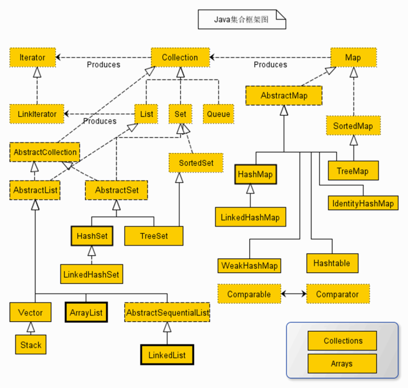

# 集合

Java 集合概述 

•Java 集合就像一种容器，可以把**多个对象的引用放入容器中。** 

•Java 集合类可以用于存储数量不等的多个对象，还可用于保存具有映射关系的关联数组 

•Java 集合可分为 Set、List 和 Map 三种体系 

List：有序，可重复的集合 

Set：无序、不可重复的集合 

Map：具有映射关系的集合 

在 Java5 之前，Java 集合会丢失容器中所有对象的数据类型，把所有对象都当成 Object 类型处理； 

从 Java5 增加了泛型以后，Java 集合可以记住容器中对象的数据类型 

Collection接口是JAVA中集合架构的根接口 

Collection 接口是 List、Set 和 Queue 接口的父接口，该接口里定义的方法既可用于操作 Set 集合，也可用于操作 List 和 Queue 集合

## 遍历 

使用 Iterator 接口遍历集合元素 

 

Iterator 接口主要用于遍历 Collection 集合中的元素，Iterator 对象也被称为迭代器 

Iterator 接口隐藏了各种 Collection 实现类的底层细节，向应用程序提供了遍历 Collection 集合元素的统一编程接口 

Iterator 仅用于遍历集合，Iterator 本身并不提供承装对象的能力。如果需要创建 Iterator 对象，则必须有一个被迭代的集合。 

.png)

使用 foreach 循环遍历集合元素 

Java 5 提供了 foreach 循环迭代访问 Collection 

## List  

List 代表一个元素有序、且可重复的集合，集合中的每个元素都有其对应的**顺序索引** 

List 允许使用重复元素，可以通过索引来访问指定位置的集合元素。 

List 默认按元素的添加顺序设置元素的索引。 

List 集合里添加了一些根据索引来操作集合元素的方法 

void add(int index, Object ele) 

boolean addAll(int index, Collection eles) 

Object get(int index) 

int indexOf(Object obj) 

int lastIndexOf(Object obj) 

Object remove(int index) 

Object set(int index, Object ele) 

List subList(int fromIndex, int toIndex) 

List的实现类 需要掌握 ArrayList Vector和LinkedList    其中 Vector 只需了解 

ArrayList 和 Vector 是 List 接口的两个典型实现 父类都是AbstractList 

区别： 

Vector是一个古老的集合，通常建议使用 ArrayList 

ArrayList 是线程不安全的，而 Vector 是线程安全的。 

通常情况下，不会在多线程中对列表进行操作，没有必要使用安全的Vector  一般而言 ArrayList 的速度要快于Vector 

即使为保证 List 集合线程安全，也不推荐使用 Vector 

Arrays.asList(…) 方法返回的 List 集合即不是 ArrayList 实例，也不是 Vector 实例。 Arrays.asList(…) 返回值是一个固定长度的 List 集合。 

ArrayList和Vector在堆中保存的数据都是连续的内存单元  而LinkedList中的每个元素在内存中不一定是连续的 位置由JVM或OS指定 

ArrayList和LinkedList比较： 

各有优缺点 

1.ArrayList占据的空间块比较大 LinkedList占据的空间块比较多   综合而言LinkedList占据的内存更多 

2.数据操作时  如数据的增加 删除时    LinkedList相对更快   修改时 ArrayList更快一点点 

3.数据查询时 ArrayList要快于LinkedList 

由于业务需要，开发中，数据一般保存在数据库中，数据的容量提前是已知的，数据的操作一般由数据库完成 所以使用ArrayList的机会相对更多 

 

 

List 额外提供了一个 listIterator() 方法，该方法返回一个 ListIterator 对象， ListIterator 接口继承了 Iterator 接口，提供了专门操作 List 的方法： 

boolean hasPrevious() 

Object previous() 

void add() 

## Set  

Set 集合不允许包含相同的元素，如果试把两个相同的元素加入同一个 Set 集合中，则添加操作失败。Set不能存放null元素，HashSet最多只有一个null元素 

Set 判断两个对象是否相同不是使用 == 运算符，而是根据 equals 方法 

 

HashSet 

HashSet 是 Set 接口的典型实现，大多数时候使用 Set 集合时都使用这个实现类。 

HashSet 按 Hash 算法来存储集合中的元素，因此具有很好的存取和查找性能。 

HashSet 具有以下特点： 

不能保证元素的排列顺序 

HashSet 不是线程安全的 

集合元素可以使 null 

当向 HashSet 集合中存入一个元素时，HashSet 会调用该对象的 hashCode() 方法来得到该对象的 hashCode 值，然后根据 hashCode 值决定该对象在 HashSet 中的存储位置。 

如果两个元素的 equals() 方法返回 true，但它们的 hashCode() 返回值不相等，hashSet 将会把它们存储在不同的位置，但依然可以添加成功。 

 

 

 

HashSet 集合判断两个元素相等的标准：两个对象通过 equals() 方法比较相等，并且两个对象的 hashCode() 方法返回值也相等。 

如果两个对象通过 equals() 方法返回 true，这两个对象的 hashCode 值也应该相同。 

重写 hashCode() 方法的基本原则 

在程序运行时，同一个对象多次调用 hashCode() 方法应该返回相同的值 

当两个对象的 equals() 方法比较返回 true 时，这两个对象的 hashCode() 方法的返回值也应相等 

对象中用作 equals() 方法比较的 Field，都应该用来计算 hashCode 值 

 

一般而言,hashCode方法和equals方法都是一起重写 

 

 

 

 

 

 

 

LinkedHashSet 是 HashSet 的子类 

LinkedHashSet 集合根据元素的 hashCode 值来决定元素的存储位置，但它同时使用链表维护元素的次序，这使得元素看起来是以插入顺序保存的。 

LinkedHashSet 性能插入性能略低于 HashSet，但在迭代访问 Set 里的全部元素时有很好的性能。 

LinkedHashSet 不允许集合元素重复。 

 

 

 

TreeSet 是 SortedSet 接口的实现类，TreeSet 可以确保集合元素处于排序状态。 

 

LinkedHashSet 和SortedSet 顺序的区别： 

LinkedHashSet 按插入元素的顺序，SortedSet 按照元素的比较进行排序 

对于无法排序的对象 插入到SortedSet中时会报异常 

Exception in thread "main" java.lang.ClassCastException: cannot be cast to java.lang.Comparable 

 

### Interface Comparable<T> 

该接口提供对象的排序（比较）方法，该接口只提供一个方法compareTo返回int类型 

 

 

Comparator comparator() 

Object first() 

Object last() 

Object lower(Object e) 

Object higher(Object e) 

SortedSet subSet(fromElement, toElement) 

SortedSet headSet(toElement) 

SortedSet tailSet(fromElement) 

 

TreeSet 支持两种排序方法：自然排序和定制排序。默认情况下，TreeSet 采用自然排序。 

 

 

 

自然排序 

 

排序：TreeSet 会调用集合元素的 compareTo(Object obj) 方法来比较元素之间的大小关系，然后将集合元素按升序排列 

如果试图把一个对象添加到 TreeSet 时，则该对象的类必须实现 Comparable 接口。 

实现 Comparable 的类必须实现 compareTo(Object obj) 方法，两个对象即通过 compareTo(Object obj) 方法的返回值来比较大小。 

Comparable 的典型实现： 

BigDecimal、BigInteger 以及所有的数值型对应的包装类：按它们对应的数值大小进行比较 

Character：按字符的 UNICODE 值来进行比较 

Boolean：true 对应的包装类实例大于 false 对应的包装类实例 

String：按字符串中字符的 UNICODE 值进行比较 

Date、Time：后边的时间、日期比前面的时间、日期大 

因为只有相同类的两个实例才会比较大小，所以向 TreeSet 中添加的应该是同一个类的对象 

当需要把一个对象放入 TreeSet 中，重写该对象对应的 equals() 方法时，应保证该方法与 compareTo(Object obj) 方法有一致的结果：如果两个对象通过 equals() 方法比较返回 true，则通过 compareTo(Object obj) 方法比较应返回 0 

 

定制排序 

•如果需要实现定制排序，则需要在创建 TreeSet 集合对象时，提供一个 Comparator 接口的实现类对象。由该 Comparator 对象负责集合元素的排序逻辑 

##  Map  

A map cannot contain duplicate keys; each key can map to at most one value.  

map对象不能包含重复的键，但是值是可以重复的，每个键最多映射1个值，键可以不映射值，多个键可以映射到同一个值 

Map 用于保存具有映射关系的数据，因此 Map 集合里保存着两组值，一组值用于保存 Map 里的 Key，另外一组用于保存 Map 里的 Value； 

本质上，Map的键为Set集合，map的值为List集合 

Map 中的 key 和 value 都可以是任何引用类型的数据，也都可以是基本数据类型的数据 

Map 中的 Key 不允许重复，即同一个 Map 对象的任何两个 Key 通过 equals 方法比较中返回 false 

Key 和 Value 之间存在单向一对一关系，即通过指定的 Key 总能找到唯一的，确定的 Value。 HashMap & Hashtable 

 

HashMap 和 Hashtable 是 Map 接口的两个典型实现类 

区别： 

Hashtable 是一个古老的 Map 实现类，不建议使用 

Hashtable 是一个线程安全的 Map 实现，但 HashMap 是线程不安全的。 

Hashtable 不允许使用 null 作为 key 和 value，而 HashMap 可以 

与 HashSet 集合不能保证元素的顺序的顺序一样，Hashtable 、HashMap 也不能保证其中 key-value 对的顺序 

Hashtable 、HashMap 判断两个 Key 相等的标准是：两个 Key 通过 equals 方法返回 true，hashCode 值也相等。 

Hashtable 、HashMap 判断两个 Value相等的标准是：两个 Value 通过 equals 方法返回 true 

 

 

 

LinkedHashMap 

LinkedHashMap 是 HashMap 的子类 

LinkedHashMap 可以维护 Map 的迭代顺序：迭代顺序与 Key-Value 对的插入顺序一致 

 

 

Properties 

Properties 类是 Hashtable 的子类，该对象用于处理属性文件 

由于属性文件里的 key、value 都是字符串类型，所以 properties 里的 Key 和 Value 都是字符串类型的 

 

 

 

TreeMap 

 TreeMap 存储 Key-Value 对时，需要根据 Key 对 key-value 对进行排序。TreeMap 可以保证所有的 Key-Value 对处于有序状态。 

TreeMap 的 Key 的排序： 

自然排序：TreeMap 的所有的 Key 必须实现 Comparable 接口，而且所有的 Key 应该是同一个类的对象，否则将会抛出 ClasssCastException 

定制排序：创建 TreeMap 时，传入一个 Comparator 对象，该对象负责对 TreeMap 中的所有 key 进行排序。此时不需要 Map 的 Key 实现 Comparable 接口 

## 集合工具类 

Collections 是一个操作 Set、List 和 Map 等集合的工具类 

Collections 中提供了大量方法对集合元素进行排序、查询和修改等操作，还提供了对集合对象设置不可变、对集合对象实现同步控制等方法 

排序操作： 

reverse(List)：反转 List 中元素的顺序 

shuffle(List)：对 List 集合元素进行随机排序 

sort(List)：根据元素的自然顺序对指定 List 集合元素按升序排序 

sort(List，Comparator)：根据指定的 Comparator 产生的顺序对 List 集合元素进行排序 

swap(List，int， int)：将指定 list 集合中的 i 处元素和 j 处元素进行交换 

 

 

查找、替换 

 

Object max(Collection)：根据元素的自然顺序，返回给定集合中的最大元素 

Object max(Collection，Comparator)：根据 Comparator 指定的顺序，返回给定集合中的最大元素 

Object min(Collection) 

Object min(Collection，Comparator) 

int frequency(Collection，Object)：返回指定集合中指定元素的出现次数 

boolean replaceAll(List list，Object oldVal，Object newVal)：使用新值替换 List 对象的所有旧值 

 

同步控制 

 •Collections 类中提供了多个 synchronizedXxx() 方法，该方法可使将指定集合包装成线程同步的集合，从而可以解决多线程并发访问集合时的线程安全问题 

 