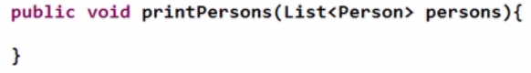

# 泛型

 

不使用泛型时:

1.集合中的类型并不安全,可向集合中放入任何引用类型的对象   使用后可放入泛型的类型及其子类型

2.从集合中取出的数据对象都是Object类型,在具体操作时,需要对其进行强制类型的转换,在转换时,可能会发生java.lang.ClassCastException

在TreeSet中使用泛型

 

 

使用泛型之后的遍历方式

1.原始for循环

2.增强for循环

3.使用iterator遍历 

 

##  自定义泛型

看List源代码

 

写一个Dao类,传入T类型,在Dao类里写save方法,测试save方法,写一个get方法,用于返回T类型

 

public class Dao<T> {

public void save(T t){

System.out.print("保存T成功!");

System.out.println(t.toString());

}

public T get(int index){

T t=**null**;

**return** t;

}

}

 

  

 

类型参数在整个类的声明中可用，几乎是所有可以使用其他普通类型的地方

 

 

## 泛型与继承

List<Object>不是List<Person>的父类

原因:

 

定义一个方法

尝试传入List<Student>类型

泛型通配符

## 练习

考虑一个简单的画图程序，它可以用来画各种形状，比如矩形和圆形。 

 

Shape 

Circle

Rectangle

这些类可以在一个画布(Canvas)上被画出来:

public void draw(Shape  s)  { 

s.draw(**this**); 

}     

所有的图形通常都有很多个形状。假定它们用一个list 来表示，Canvas里有一个方法来画出所有的形状会比较方便

public void drawAll(List<? extends Shape>  shapes)  { 

​          **for** (Shape  s  :  shapes)  { 

​             s.draw(**this**); 

​         } 

} 