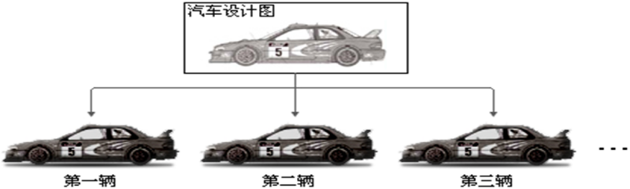
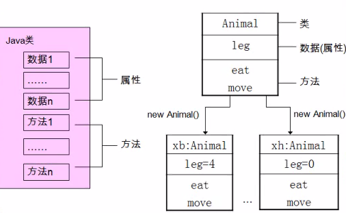
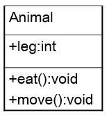
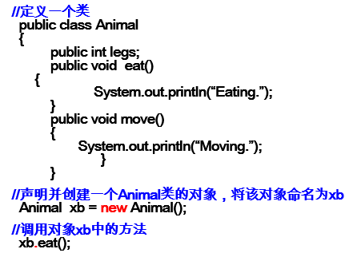
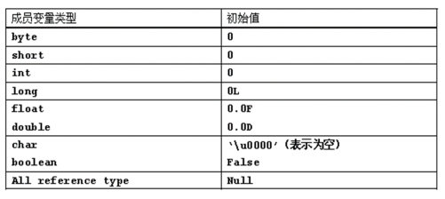
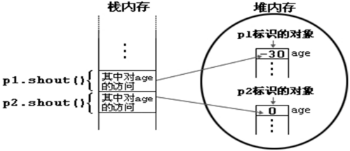
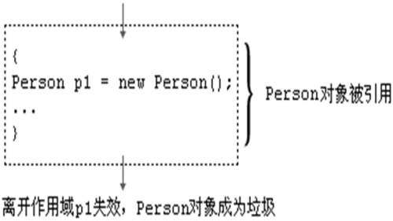
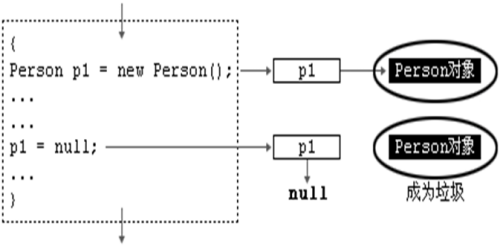

# 类和对象

## 概念

**类(class)**和**对象(object)**是面向对象编程的核心概念。

**类**是对一类事物描述，是抽象的、概念上的定义；

按照人脑习惯将具备相同属性和行为的事物进行**分类**

**对象**是实际存在的该类事物的每个**个体**或者**个体的集合**，因而也称**实例**(instance)。



如果将对象比作汽车，那么类就是汽车的设计图纸。

所以面向对象程序设计的重点是**类的设计**，而不是对象的设计。对象是由类生成的 

JDK中已经定义好了很多的常用类，不再需要用户自行开发，当然也可以自己创建类； JDK中除了8种基本数据类型，其它的都是类


### 万物皆对象

**对象（object）**代表现实世界中可以明确标识的一个**实体**。

例如：一个学生、一张桌子、一间教室，一台电脑都可以看做是一个对象。（对象的集合后面再讲）

# 属性和方法

每个对象都有自己独特的状态标识和行为 

## 属性

对象的属性（attribute，或者状态（state））

学生有姓名和学号，该学生特有的姓名和学号就是该学生（对象）的属性。

## 方法

对象的行为（behavior），是由方法定义，调用对象的一个方法，其实就是要求对象完成一个动作。可以定义学生对象具备学习的行为。学生对象可以调用学习的方法，执行学习的动作







- legs是类的属性 ，也叫类 成员 变量 。
- eat,move是方法也叫类的 成员 函数。

#  语法

**声明类**的语法格式


[< 修饰符>] class <类名> 

{

​	[<构造器声明>]

​	[<属性声明>]

​	[<方法声明>]

}

 

## 声明属性

 

语法格式：

[<修饰符>] 类型 < 属性名> [=初值] ; 

说明：修饰符 private: 该属性只能由该类的方法访问。

修饰符 public: 该属性可以被该类以外的方法访问。

类型：任何基本类型，如int、boolean或任何类。

举例：

```Java
public class Person{

private int age; //声明private变量 age

public String name = “Lila”; //声明public变量 name

}
```

 

 

## 声明方法

语法格式：

<修饰符> <返回类型> <方法名>([< 参数表>]) {

[< 语句>]

} 

 

说明： 修饰符：public,private,protected 等。

返回类型：return语句传递返回值。没有返回值：void。

举例：

```java
public class Person{

    private int age;

    public int getAge() { return age; } //声明方法getAge

    public void setAge(int i) { //声明方法setAge

    age = i; //将参数i的值赋给类的成员变量age

    }

}
```

 

## 对象的创建和使用

### 创建

使用 new +构造方法 创建一个新的对象；

使用 “对象名.对象成员” 的方式访问对象成员（包括属性和方法）；

 如果创建了一个类的多个对象，对于类中定义的属性，每个对象都拥有各自的一套副本，且互不干扰。

```java
public class Zoo{
    public static void main(String args[]){
	Animal xb=new Animal();
	Animal xh=new Animal();
	xb.legs=4;
	xh.legs=0;
	System.out.println(xb.legs);   //
	System.out.println(xh.legs);   //
	xb.legs=2;
	System.out.println(xb.legs);   //
	System.out.println(xh.legs);   //
    }
}
```

 

类的访问机制：

在一个类中的访问机制：类中的方法可以直接访问类中的成员变量。（有一个例外）

在不同类中的访问机制：先创建要访问类的对象，再用对象访问类中定义的成员。

 

### 对象的产生

```java
class Person
{
  int age;
  void shout() {
  System.out.println(“oh,my god! I am “ + age);
  }
}
Person p1 = new Person();//执行完后的内存状态
```

Person p1 = new Person();执行完后的内存状态


当一个对象被创建时，会对其中各种类型的成员变量自动进行初始化赋值。除了基本数据类型之外的都是变量类型都是引用类型，如上面的Person及前面讲过的数组。 

在堆内存中的初始值



### 对象的使用

创建新的对象之后,我们就可以使用“ 对象名.对象成员 ”的格式，来访问对象的员 

```Java
class TestPerson
{
  public static void main(String[] args)  //上面程序运行的内存布局如下图 

  {
          Person p1 = new Person();
	  Person p2 =new Person();
	  p1.age = -30;
	  p1.shout();
	  p2.shout();
  }
}

```



## 对象的生命周期(lifecycle)



p1放在栈内存中，离开作用域后会立即回收，new Person()在堆内存中，离开作用域后不能再被使用，但不会立即被回收，JVM会将其内存地址标记为可回收(不再可用)，等空闲时或资源不足时再回收,程序员无法手动回收

**实际上，栈中的变量指向堆内存中的变量，这就是 Java 中的指针!**




**匿名对象** 

•我们也可以不定义对象的句柄，而直接调用这个对象的方法。这样的对象叫做匿名对象， 如：new Person().shout();

•如果对一个对象只需要进行一次方法调用，那么就可以使用匿名对象。 

•我们经常将匿名对象作为实参传递给一个函数调用。

##  

# 成员变量与局部变量

**成员变量**: 定义在类中变量

**局部变量**: 定义在方法中变量


**成员变量与局部变量的区别：**

1. 应用范围  

2. 1. 成员变量在整个类内都有效    
   2. 局部变量只在其声明的方法内有效

3. 生命周期  

4. 1. 成员变量: 它属于对象，它随着对象的创建而创建，随着对象的消失而消失 
   2. 局部变量: 使用完马上释放空间。

```Java
void show(int id){    
    for(int i=0;i<10;i++){
        for(int j=0;j<10;j++){
        System.out.println(id);
        }
    }
}
```

这时候  id,i,j者是在方法内声明的，全是局部变量

j当里层for循环执行它的生命周期开始，当里层for结束，j消失

i当外层for循环执行它的生命周期开始，当外层for结束，j消失

id在方法被调用时开始，方法结束时，id消失.

1. 存储位置  成员变量属于对象，它存储在堆内，堆内的实体，当没有引用指向其时，才垃圾回收清理      局部变量存在栈内存中，当不在使用时，马上就会被释放。
2. 初始值 

成员变量它存储在堆中，如果没有赋初值，它有默认值。

1. 整数byte、short、int、long      =0；
2. char='\u0000'；
3. boolean=flase；
4. String =null;
5. 类类型 =null；
6. 数组 =null；

​    局部变量，如果要想使用必须手动初始化. 运行时未初始化，则会报错

1. 方法中，参数列表中，语句中。
2. 必须给初始化值，没有初始值，不能使用
3. 在栈内存中


# 练习

1. 创建一个Person类，其定义如下


要求：(1)创建Person类的对象，设置该对象的name、age和sex属性，调用study方法，输出字符串“studying”，调用showAge()方法显示age值，调用addAge()方法给对象的age属性值增加 i 岁。

(2)创建第二个对象，执行上述操作，体会同一个类的不同对象之间的关系。

 

2.创建修 车 厂 类

具 备 公 共 属 性 ： 名 字 、 地 址 、 电 话 。

公 共 的 行 为 修 车 。 

 

3. 利用面向对象的编程方法，设计类Circle计算圆的面积和周长。

