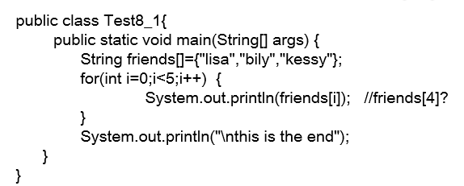
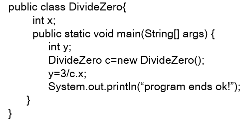
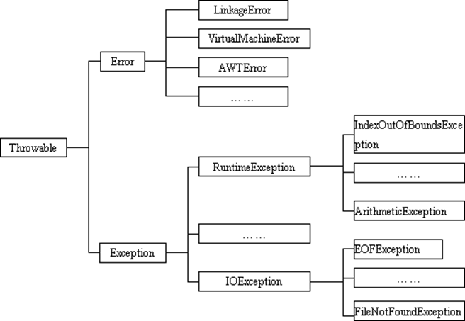

# 异常

Java异常

 

任何一种程序设计语言设计的程序在运行时都有可能出现异常，例如除数为0，数组下标越界，要读写的文件不存在等等。

捕获错误最理想的是在编译期间，但有的异常只有在运行时才会发生。

对于这些异常，一般有两种解决方法：

遇到异常就终止程序(当前线程)的运行。

由程序员在编写程序时，就考虑到错误的检测、错误消息的提示，以及错误的处理。

 

 

•异常：在Java语言中，将程序执行中发生的不正常情况称为“异常”。

 

•Java中的异常用于处理非预期的情况，如文件没找到，网络错误，非法的参数

 

 

Java程序运行过程中所发生的问题事件可分为两类：

Error: JVM系统内部错误、资源耗尽等严重情况

Exception: 其它因编程错误或偶然的外在因素导致的一般性问题，例如：

空指针访问

试图读取不存在的文件

网络连接中断

 

案例:

错误

java.lang.StackOverflowError

 

异常

数组下标越界

空指针

数字格式转换异常

类型转换异常

 

编译期异常

FileInputStream fos=new FileInputStream(new File());

Class.forName("com.mysql.jdbc.Driver");

 

Exception可以分为运行时异常和编译时异常  直接或者间接继承自RuntimeException的异常就是运行时异常  其他的就是编译时异常

error与exception的区别

1. error更严重

2. error在代码里无法处理,而exception可以处理

 

常见异常 

RuntimeException 

错误的类型转换

数组下标越界

空指针访问

 

 

IOExeption

从一个不存在的文件中读取数据

越过文件结尾继续读取

连接一个不存在的URL

## 异常处理机制

在编写程序时，经常要在可能出现错误的地方加上检测的代码，如进行x/y运算时，要检测分母为0，数据为空，输入的不是数据而是字符等。过多的分支会导致程序的代码加长，可读性差。因此采用异常机制。

 

§Java异常处理：Java采用异常处理机制，将异常处理的程序代码集中在一起，与正常的程序代码分开，使得程序简洁，并易于维护。

 

 

 

§Java提供的是异常处理的**抓抛模型**。

 

 

Java程序的执行过程中如出现异常，会自动生成一个异常类对象，该异常对象将被提交给Java运行时系统(JVM)，这个过程称为抛出(throw)异常。

如果一个方法内抛出异常，该异常会被抛到调用方法中。如果异常没有在调用方法中处理，它继续被抛给这个调用方法的调用者。这个过程将一直继续下去，直到异常被处理。这一过程称为捕获(catch)异常。

如果一个异常回到main()方法，并且main()也不处理，则程序运行终止。

程序员通常只能处理Exception，而对Error无能为力。

 

 

 

 

异常处理是通过try-catch-finally语句实现的

 

try

{

...... //可能产生异常的代码

}

catch( ExceptionName1 e )

{

...... //当产生ExceptionName1型异常时的处置措施

}

catch( ExceptionName2 e )

{

...... //当产生ExceptionName2型异常时的处置措施

} 

[ finally{

...... //无条件执行的语句

} ]

 

 

 

 

从语法上讲 try catch finally 

try代码块一定要

catch和finally至少要出现一个

 

 

 

 

 

 

public class Test8_2{

​       public static void main(String[] args)    {

​      String friends[]={"lisa","bily","kessy"};

​       **try** {

​              **for**(int i=0;i<5;i++) {

​               System.out.println(friends[i]);

​                 }

​       } 

**catch**(ArrayIndexOutOfBoundsException e)  {

​                      System.out.println("index err");

​       }

​       System.out.println("\nthis is the end");

​       }

}

 

 

 

public class DivideZero1{

   int x;

​        public static void main(String[] args) {

int y;

DivideZero1 c=**new** DivideZero1();

**try**{

y=3/c.x;

}

**catch**(ArithmeticException e){       

System.out.println("divide by zero error!");

}

System.out.println("program ends ok!");

​      }

}

 

 

 

捕获异常

try 

捕获异常的第一步是用try{…}语句块选定捕获异常的范围，将可能出现异常的代码放在try语句块中。

catch (Exceptiontype e)

在catch语句块中是对异常对象进行处理的代码。每个try语句块可以伴随一个或多个catch语句，用于处理可能产生的不同类型的异常对象。

 

 

如果明确知道产生的是何种异常，可以用该异常类作为catch的参数；也可以用其父类作为catch的参数。建议使用该异常类作为catch的参数，进行多层捕捉异常 

捕捉多层时，catth父对象的代码块，要放在catch子对象代码块的后面

如果某个catch语句已经捕捉到，那么后面的catch语句都不会再执行

可以用ArithmeticException类作为参数，也可以用RuntimeException类作为参数，或者用所有异常的父类Exception类作为参数。但不能是与ArithmeticException类无关的异常，如NullPointerException，那么，catch中的语句将不会执行。

 

 

捕获异常的有关信息：

与其它对象一样，可以访问一个异常对象的成员变量或调用它的方法。

getMessage( ) 方法，用来得到有关异常事件的信息

printStackTrace( )用来跟踪异常事件发生时执行堆栈的内容。

 

finally

捕获异常的最后一步是通过finally语句为异常处理提供一个统一的出口，使得在控制流转到程序的其它部分以前，能够对程序的状态作统一的管理。不论在try、catch代码块中是否发生了异常事件，finally块中的语句都会被执行。

finally语句是可选的

 

 

 

练习

 

编写一个会发生异常的程序：

练习捕获和不捕获异常，程序的运行有什么不同。

练习try语句块中可能发生多个不同异常时的处理。

练习finally语句块的使用。

 

 

 

运行时异常和编译时异常

 

前面但使用的异常都是RuntimeException类或是它的子类，这些类的异常的特点是：即使没有使用try和catch捕获，Java自己也能捕获，并且编译通过 ( 但运行时会发生异常使得程序运行终止 )。

如果抛出的异常是IOException类的异常，则必须捕获，否则编译错误。

 

 

 

 

import java.io.*;

public class Test8_3{

​       public static void main(String[] args)    {

​       FileInputStream in=**new** FileInputStream("myfile.txt");

​       int b;

b = in.read();

​       **while**(b!= -1)       {

​                        System.out.print((char)b);

​          b = in.read();

​       }

​       in.close();

​       }

}

 

 

 

声明抛出异常是Java中处理异常的第二种方式

如果一个方法(中的语句执行时)可能生成某种异常，但是并不能确定如何处理这种异常，则此方法应显式地声明抛出异常，表明该方法将不对这些异常进行处理，而由该方法的调用者负责处理。

在方法声明中用 throws 子句可以声明抛出异常的列表，throws后面的异常类型可以是方法中产生的异常类型，也可以是它的父类。

声明抛出异常举例：

public void readFile(String file)  throws FileNotFoundException {

……

// 读文件的操作可能产生FileNotFoundException类型的异常

FileInputStream fis = **new** FileInputStream(file);

 ..……

​     }

 

 

练习

 

•修改练习1中的程序，将异常的捕获处理放到main方法中。

 

 

重写方法声明抛出异常的原则

§重写方法不能抛出比被重写方法范围更大的异常类型

​    public class A {

  public void methodA() throws IOException {

​        ……

  }

​    }

​    public class B1 extends A {

  public void methodA() throws FileNotFoundException {

​        ……

  }

​    }

​    public class B2 extends A {

  public void methodA() throws Exception {   //error

​          ……

​     }

​    }

 

 

 

人工抛出异常

 

Java异常类对象除在程序执行过程中出现异常时由系统自动生成并抛出，也可根据需要人工创建并抛出

首先要生成异常类对象，然后通过throw语句实现抛出操作(提交给Java运行环境)。

IOException e =new IOException();

throw e;

可以抛出的异常必须是Throwable或其子类的实例。下面的语句在编译时将会产生语法错误：

throw new String("want to throw");

 

## 自定义异常

用户自定义异常类MyException，用于描述数据取值范围错误信息。用户自己的异常类必须继承现有的异常类。

自定义的异常必须直接或者间接的继承自java.lang.Exception

 

 

class MyException extends Exception {

​    private int idnumber;

  public MyException(String message, )int id {

**super**(message);

**this**.idnumber = id;

  } 

public int getId() {

**return** idnumber;

  }

}

 

 

 

使用用户自定义异常类

public class Test8_6{

​        public void regist(int num) throws MyException {

  **if** (num < 0) 

​            **throw** **new** MyException(“人数为负值，不合理”,3);

**else**

​          System.out.println("登记人数" + num );

​        }

​        public void manager() {

  **try** {

​           regist(100);

  } **catch** (MyException e) {

​             System.out.print("登记失败，出错种类"+e.getId());   

}

System.out.print("本次登记操作结束");

​       }

​       public static void main(String args[]){

Test8_6 t = **new** Test8_6();

t.manager();

​       }

}

 

 

**练习**

 

编写应用程序EcmDef.java，接收命令行的两个参数，要求不能输入负数，计算两数相除。

对缺少命令行参数(ArrayIndexOutOfBoundsException)、

除0(ArithmeticException)及输入负数(EcDef 自定义的异常)进行异常处理。

提示：

(1)在主类(EcmDef)中定义异常方法(ecm)完成两数相除功能。

(2)在main()方法中使用异常处理语句进行异常处理。

(3)在程序中，自定义对应输入负数的异常类(EcDef)。

(4)运行时接受参数 java EcmDef 20 10 

//args[0]=“20” args[1]=“10”

(5)Interger类的static方法parseInt(String s)将s转换成对应的int值。如int a=Interger.parseInt(“314”); //a=314;