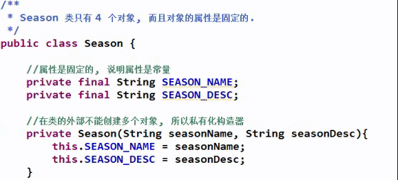
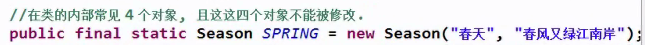
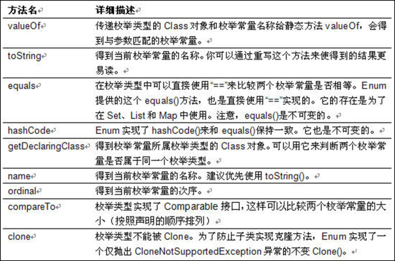

# 枚举

在某些情况下，一个类的对象是有限而且固定的。

例如季节类，只能有 4 个对象

手动实现枚举类：





private 修饰构造器    让对象不能使用new的方式创建出来

属性使用 private final 修饰

把该类的所有实例都使用 public static final 来修饰

实例名最好全部使用大写字母

## 定义枚举

JDK 1.5 新增的 enum 关键字用于定义枚举类

枚举类和普通类的区别：

使用 enum 定义的枚举类默认继承了 java.lang.Enum 类

枚举类的构造器只能使用 private 访问控制符

枚举类的所有实例必须在枚举类中显式列出(, 分隔 ; 结尾). 列出的实例系统会自动添加 public static final 修饰

所有的枚举类都提供了一个 values 方法, 该方法可以很方便地遍历所有的枚举值

JDK 1.5 中可以在 switch 表达式中使用枚举类的对象作为表达式, case 子句可以直接使用枚举值的名字, 无需添加枚举类作为限定

若枚举只有一个成员, 则可以作为一种单子模式的实现方式

枚举类对象的属性不应允许被改动, 所以应该使用 private final 修饰

枚举类使用 private final 修饰的属性应该在构造器中为其赋值

若枚举类显式的定义了带参数的构造器, 则在列出枚举值时也必须对应的传入参数

```java
package com.chinasofti.generic.shape;

 

public enum Season {

/*

 \* 枚举类必须在类的开始列出所有的实例

 */

SPRING("春天","1"),

SUMMER("夏天","2"),

AUTUMN("秋天","3");

String seasonName;

String seasonDesc;

private Season(String seasonName, String seasonDesc) {

this.seasonName = seasonName;

this.seasonDesc = seasonDesc;

}

 

}
```


 

 

 

枚举的对象不可修改,但对象的属性可修改,如果不想修改其属性,可使用final修饰属性

 

 

 

 

 

 

 

案例:

将太阳的七色光定义成枚举类型   要求给光定义颜色名以及颜色地含义

## 枚举的方法

1.遍历枚举类

Season[] seasons=Season.values();

**for**(Season season:seasons){

System.out.println(season);

}

//每个枚举类都有一个values方法,返回枚举类型对象的数组

 

 

2.把一个字符串转为枚举类对应的对象

String str="SPRING";

Season s=Enum.valueOf(Season.class, str); 

System.out.println(s);

 

 

3.枚举类实现接口

根据不同的类型,返回不同的字符串

在1.7版本后,switch表达式里可传入字符串和枚举类型

@Override

public String getInfo() {

**switch** (**this**) {

**case** SPRING:

**return** "希望";

**case** SUMMER:

**return** "热情";

**case** AUTUMN:

**return** "丰收";

}

**return** **null**;

}

 

也可让每个实例提供单独的实现

 

SPRING("春天","1"){

@Override

public String getInfo() {

**return** "春天";

}

},


## 练习

将太阳系中,所有的行星封装到一个枚举中

 

 

