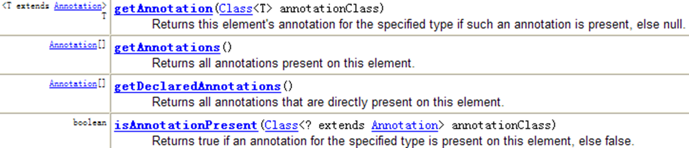

# 注解 Annotation

从 JDK 5.0 开始, Java 增加了对元数据(MetaData) 的支持, 也就是 Annotation(注解)

Annotation 其实就是代码里的特殊标记, 这些标记可能可以在编译, 类加载, 运行时被读取, 并执行相应的处理. 通过使用 Annotation, 程序员可以在不改变原有逻辑的情况下, 在源文件中嵌入一些补充信息.

Annotation 可以像修饰符一样被使用, 可用于修饰包,类, 构造器, 方法, 成员变量, 参数, 局部变量的声明等  不是所有的注解都可以修饰包,类, 构造器, 方法, 成员变量, 参数等  这些信息被保存在 Annotation 的 “name=value” 对中.

注解对应java中的接口是 java.lang.annotation.Annotation  （需要导入）

 

Annotation 能被用来为程序元素(类, 方法, 成员变量等) 设置元数据

 

 

 

java.lang.annotation.Annotation是所有的注解类型的基接口

 

 

 

 

 

 

 

 

基本的 Annotation

 

使用 Annotation 时要在其前面增加 @ 符号, 并把该 Annotation 当成一个修饰符使用. 用于修饰它支持的程序元素

一般而言注解写在被标记元素的上一行,除了用于标记形式参数时.

 

三个基本的 Annotation:

@Override: 限定重写父类方法或者实现接口的方法, 该注解只能用于方法

@Deprecated: 用于表示某个程序元素(类, 方法等)已过时

@SuppressWarnings: 抑制编译器警告.   一定要带参数，参数为String[]类型@SuppressWarnings("deprecation")

 

 

 

 

 

 

 

 

 

自定义注解

关键字 @interface

 

 

定义新的 Annotation 类型使用 @interface 关键字

Annotation 的成员变量在 Annotation 定义中以无参数方法的形式来声明. 其方法名和返回值定义了该成员的名字和类型. 

可以在定义 Annotation 的成员变量时为其指定初始值, 指定成员变量的初始值可使用 default 关键字

没有成员定义的 Annotation 称为标记; 包含成员变量的 Annotation 称为元数据 Annotation

 

 

 

 

提取 Annotation 信息

JDK 5.0 在 java.lang.reflect 包下新增了 AnnotatedElement 接口, 该接口代表程序中可以接受注释的程序元素

当一个 Annotation 类型被定义为运行时 Annotation 后, 该注释才是运行时可见, 当 class 文件被载入时保存在 class 文件中的 Annotation 才会被虚拟机读取

程序可以调用 AnnotationElement 对象的如下方法来访问 Annotation 信息

 

 

元 Annotation

 

 

JDK 的元 Annotation 用于修饰其他 Annotation 定义

@Retention: 只能用于修饰一个 Annotation 定义, 用于指定该 Annotation 可以保留多长时间, @Rentention 包含一个 RetentionPolicy 类型的成员变量, 使用 @Rentention 时必须为该 value 成员变量指定值:

RetentionPolicy.CLASS: 编译器将把注解记录在 class 文件中. 当运行 Java 程序时, JVM 不会保留注解. 这是默认值

RetentionPolicy.RUNTIME:编译器将把注解记录在 class 文件中. 当运行 Java 程序时, JVM 会保留注解. 程序可以通过反射获取该注解(最常用)

RetentionPolicy.SOURCE: 编译器直接丢弃这种策略的注解 (几乎没用,相当于注释)

@Target: 用于修饰 Annotation 定义, 用于指定被修饰的 Annotation 能用于修饰哪些程序元素. 

@Target 也包含一个名为 value 的成员变量.

值为ElementType枚举里的一个或多个

@Documented: 用于指定被该元 Annotation 修饰的 Annotation 类将被 javadoc 工具提取成文档.

@Inherited: 被它修饰的 Annotation 将具有继承性.如果某个类使用了被 @Inherited 修饰的 Annotation, 则其子类将自动具有该注解

