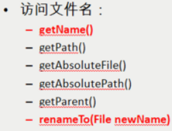
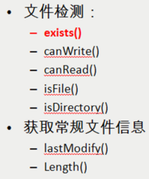
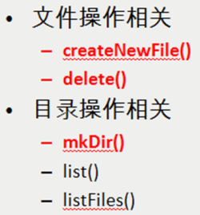
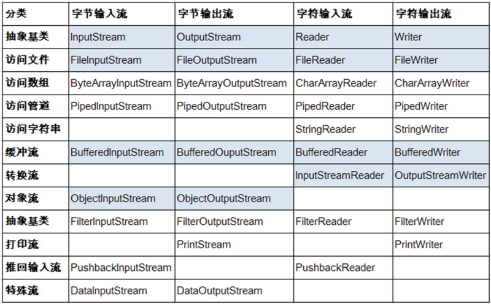
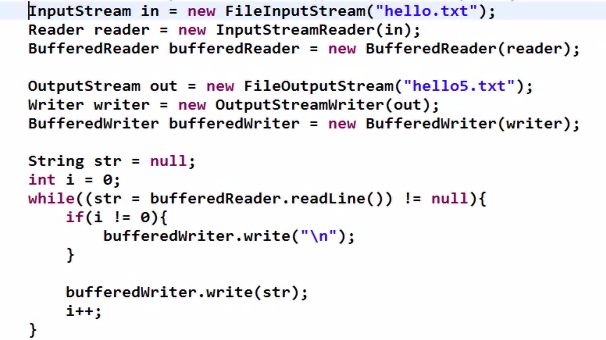

# IO

输入：JAVA代码读取外部数据（磁盘、光盘等存储设备的数据）到程序（内存）中。

输出：将JAVA程序（内存）数据输出到磁盘、光盘等存储设备中

Java 的 IO 流主要包括输入、输出两种 IO 流，

每种输入、输出流有可分为字节流和字符流两大类：

字节流以字节为单位来处理输入、输出操作

字符流以字符为单位来处理输入、输出操作

 

 

 

## File 类

 

File 类代表与平台无关的**文件和目录**。  java.io.File 

不是创建了File对象就创建了文件或者文件夹

知识操作系统中文件或文件夹的一种抽象描述

对于windows操作系统而言  文件夹的分隔符使用"\"  而Linux，unix,Mac，Android等  使用  "/"

\表示转义符  

windows操作系统 也支持"/"  标准是"\"

File 能新建、删除、重命名文件和目录，但 File 不能访问文件内容本身。如果需要访问文件内容本身，则需要使用输入/输出流。

注:重命名可用于移动文件

 

 

## IO 流的分类

 

按流向分：

输入流

输出流

按处理的单位：

字节流（8 位的字节）

字符流（16 位的字节,根据字符编码决定）

按流的角色

节点流：可以从一个特定的 IO 设备读/写数据的流

处理流：对一个已存在的流进行连接和封装，通过封装后的流来实现数据读/写操作

 

 

 

## InputStream & Reader

 

InputStream 和 Reader 是所有输入流的基类。

InputStream（典型实现：FileInputStream）：

int read()

int read(byte[] b)

int read(byte[] b, int off, int len)

Reader（典型实现：FileReader）:

int read()

int read(char [] c)

int read(char [] c, int off, int len)

程序中打开的文件 IO 资源不属于内存里的资源，垃圾回收机制无法回收该资源，所以应该显式关闭文件 IO 资源。

## OutputStream & Writer

OutputStream 和 Writer 也非常相似：

void write(byte write/int c)

void []/char[] buff)

void write(byte[]/char[] buff, int off, int len);

因为字符流直接以字符作为操作单位，所以 Writer 可以用字符串来替换字符数组，即以 String 对象作为参数

void write(String str);

void write(String str, int off, int len)

  

可使用InputStream和OutputStream完成文件的复制 

 

第一种方式使用流 

使用流的包装类进行复制 

最后需要关闭

 

使用FileChannel

private static void copyFileUsingFileChannels(File source, File dest) throws IOException {    

​        FileChannel inputChannel = **null**;    

​        FileChannel outputChannel = **null**;    

​    **try** {

​        inputChannel = **new** FileInputStream(source).getChannel();

​        outputChannel = **new** FileOutputStream(dest).getChannel();

​        outputChannel.transferFrom(inputChannel, 0, inputChannel.size());

​    } **finally** {

​        inputChannel.close();

​        outputChannel.close();

​    }

}

 

 

使用Commons IO复制

Apache Commons IO提供拷贝文件方法在其FileUtils类,可用于复制一个文件到另一个地方。它非常方便使用Apache Commons FileUtils类时,您已经使用您的项目。基本上,这个类使用Java NIO FileChannel内部

private static void copyFileUsingApacheCommonsIO(File source, File dest)

​        throws IOException {

​    FileUtils.copyFile(source, dest);

}

 

 

 

使用Java7的Files类复制

private static void copyFileUsingJava7Files(File source, File dest)

​        throws IOException {    

​        Files.copy(source.toPath(), dest.toPath());

}

 

 

 

## 对象的序列化

 

对象序列化的目标是将对象保存到磁盘上，或允许在网络中直接传输对象。

序列化是 RMI（Remote Method Invoke – 远程方法调用）过程的参数和返回值都必须实现的机制，而 RMI 是 JavaEE 的基础。因此序列化机制是 JavaEE 平台的基础

如果需要让某个对象支持序列化机制，则必须让的类是可序列化的，为了让某个类是可序列化的，该类必须实现如下两个接口之一：

Serializable

标记接口,无方法

Externalizable

 

 

 

 

### 使用对象流序列化对象

 

若某个类实现了 Serializable 接口，该类的对象就是可序列化的：

创建一个 ObjectOutputStream

调用 ObjectOutputStream 对象的 writeObject() 方法输出可序列化对象

反序列化

创建一个 ObjectInputStream

调用 readObject() 方法读取对象

如果某个类的字段不是基本数据类型或 String 类型，而是另一个引用类型，那么这个引用类型必须是可序列化的，否则拥有该类型的 Field 的类也不能序列化

 

父类实现了序列化,则子类会自动继承序列化的特性

 

 

类的版本序列号 每次代码改造后,最好都重新生成一次

 

 

 

RandomAccessFile 类

 

RandomAccessFile 类既可以读取文件内容，也可以向文件输出数据

RandomAccessFile 类支持 “随机访问” 的方式，程序可以直接跳到文件的任意地方来读写文件

支持只访问文件的部分内容

可以向已存在的文件后追加内容

RandomAccessFile 对象包含一个记录指针，用以标示当前读写处的位置。RandomAccessFile 类对象可以自由移动记录指针：

long getFilePointer()：获取文件记录指针的当前位置

void seek(long pos)：将文件记录指针定位到 pos 位置

创建 RandomAccessFile 类可以指定一个 mode 参数，该参数指定 RandomAccessFile 的访问模式：

r: 以只读方式打开

rw：以读、写方式打开

创建 RandomAccessFile 类可以指定一个 mode 参数，该参数指定 RandomAccessFile 的访问模式：

r: 以只读方式打开

rw：以读、写方式打开

 

 

 

RandomAccessFile raf=**new** RandomAccessFile("a.txt", "rw");

raf.write("你好!".getBytes("UTF-8"));

raf.seek(0);

String line=**new** String(raf.readLine().getBytes("ISO-8859-1"),"UTF-8");

System.out.println(line);

raf.close();

 

 

从键盘输入数据

\1. Scanner类中的方法 

 

2.使用流

 

BufferedReader br=**new** BufferedReader(**new** InputStreamReader(System.in));

String in=br.readLine();

1