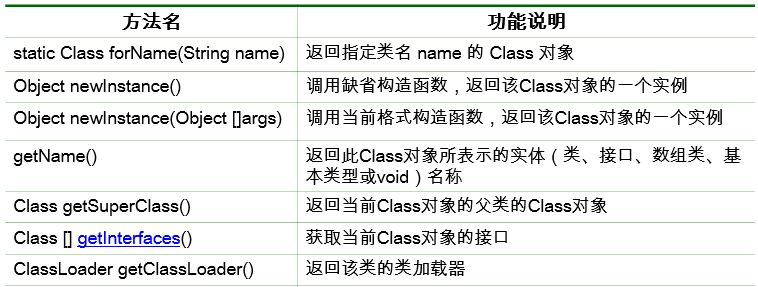
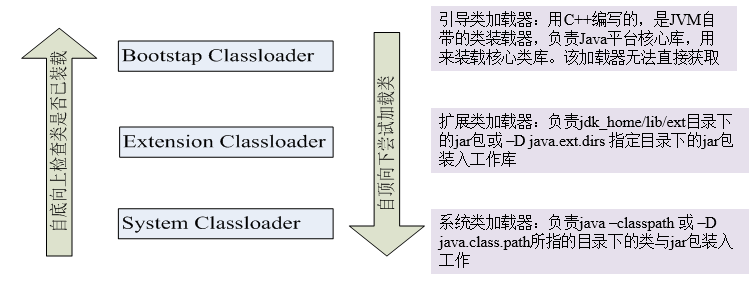
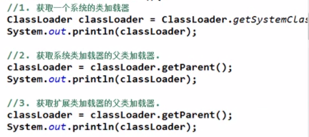
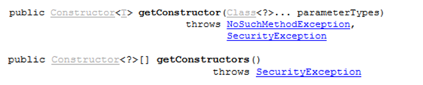

# 反射

一切都是对象

对象照镜子后可以得到的信息：某个类的数据成员名、方法和构造器、某个类到底实现了哪些接口。

对于每个类而言，JRE 都为其保留一个不变的 Class 类型的对象。一个 Class 对象包含了特定某个类的有关信息。

Class 对象只能由系统建立对象

一个类在 JVM 中只会有一个Class实例 

每个类的实例都会记得自己是由哪个 Class 实例所生成 

 

Reflection（反射）是Java被视为动态语言的关键，反射机制允许程序在执行期借助于Reflection API取得任何类的內部信息，并能直接操作任意对象的内部属性及方法。

Java反射机制主要提供了以下功能：

在运行时构造任意一个类的对象

在运行时获取任意一个类所具有的成员变量和方法

在运行时调用任意一个对象的方法（属性）

生成动态代理

 

在Java中，类对象里的枚举类型和类看作类的类型 而接口和注解，看作接口类型

数组，基本类型的数据，还有void都可以获得其类对象

 

 

 

 

 

 

 

 

 

 

获得Class对象

/*

 \* 获得Class对象

 \* 三种方式

 */

Class clazz1=String.class;

Class clazz2="chinasofti".getClass();

Class clazz3=Class.forName("java.lang.String");

System.out.println(clazz1==clazz3);

 

 

使用类对象创建对象

newInstance()方法

调用无参构造器

 

在运行时构造一个类的对象

调用 Class 对象的 newInstance() 方法

调用 Constructor 对象的 newInstance(Object... initargs) 

 Class类的常用方法

ClassLoader

 

类装载器是用来把类(class)装载进 JVM 的。JVM 规范定义了两种类型的类装载器：启动类装载器(bootstrap)和用户自定义装载器(user-defined class loader)。 JVM在运行时会产生3个类加载器组成的初始化加载器层次结构 ，如下图所示：

问题:

如何获得一个类的类加载器

测试Object类的类加载器

获取当前项目bin目录下的配置文件

InputStream is=**this**.getClass().getClassLoader().getResourceAsStream("info.properties");

BufferedReader br=**new** BufferedReader(**new** InputStreamReader(is));

String line1=br.readLine();

System.out.println(line1);

br.close();

is.close();

Constructor 对象

代表构造器对象

获取 Constructor：

相关方法：

newInstance(Object... initargs) 

setAccessible(boolean flag) 

 

 

 

 

 

 

 

Method（Field） 对象

代表方法

Class 对象获取 Method 的方法：

getDeclaredMethod(String name, Class<?>... parameterTypes) 

getDeclaredMethods() 

getMethod(String name, Class<?>... parameterTypes) 

getMethods() 

Method 对象的方法：

invoke(Object obj, Object... args) 

 

 

 

 

 

Annotation 相关

以 Method 为例：

获取 Annotation 实例：

getAnnotation(Class<T> annotationClass) 

getDeclaredAnnotations() 

getParameterAnnotations() 

 

 

 

 

 

 

 

泛型相关

获取父类泛型类型：Type getGenericSuperclass()

泛型类型：ParameterizedType

获取实际的泛型类型参数数组：getActualTypeArguments() 

