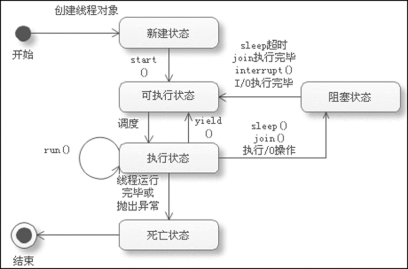

# 多线程

程序、进程与多任务

程序（program）是对数据描述与操作的代码的集合，是应用程序执行的脚本。

进程（process）是程序的一次执行过程，是操作系统运行程序的基本单位。程序是静态的，进程是动态的。系统运行一个程序即是一个进程从创建、运行到消亡的过程。

多任务（multi task）在一个系统中可以同时运行多个程序，即有多个独立运行的任务，每个任务对应一个进程。

 

 

 

线程

线程（thread）：比进程更小的运行单位，不能独立运行,是程序中单个顺序的流控制。一个进程中可以包含多个线程。

简单来讲，线程是一个独立的执行流，是进程内部的一个独立执行单元，相当于一个子程序。

一个进程中的所有线程都在该进程的虚拟地址空间中，使用该进程的全局变量和系统资源。

操作系统给每个线程分配不同的CPU时间片，在某一时刻，CPU只执行一个时间片内的线程，多个时间片中的相应线程在CPU内轮流执行。

 

 

创建多线程

每个Java程序启动后，虚拟机将自动创建一个主线程

可以通过以下两种方式自定义线程类：

创建 java.lang.Thread 类的子类，重写该类的 run方 法

创建 java.lang.Runnable接口的实现类，实现接口中的 run 方法

 继承 Thread 类

•Thread：**代表一个线程类**

Thread类中的重要方法：

run方法：包括线程运行时执行的代码，通常在子类中重写它。

//对于 java 而言就是个普通方法,对于OS而言,执行线程时,就是执行线程类中的run方法中的代码

start方法：启动一个新的线程，然后虚拟机调用新线程的run方法 

Runnable 接口中只有一个未实现的 run 方法，实现该接口的类必须重写该方法。

Runnable 接口与 Thread 类之间的区别:

Runnable 接口必须实现 run 方法，而 Thread 类中的run 方法是一个空方法，可以不重写

Runnable 接口的实现类并不是真正的线程类，只是线程运行的目标类。要想以线程的方式执行 run 方法，必须依靠 Thread 类 

Runnable 接口适合于资源的共享

 

 

线程的生命周期

 

线程的生命周期：

指线程从创建到启动，直至运行结束

可以通过调用 Thread 类的相关方法影响线程的运行状态 

 

 

线程的运行状态

新建（New）

可执行（Runnable）

运行（Running)

阻塞（Blocking)

死亡（Dead)

 

新建状态（New）

当创建了一个Thread对象时，该对象就处于“新建状态” 

没有启动，因此无法运行

可执行状态（Runnable）

其他线程调用了处于新建状态线程的start方法，该线程对象将转换到“可执行状态”

线程拥有获得CPU控制权的机会，处在等待调度阶段。 

运行状态（Running）

处在“可执行状态”的线程对象一旦获得了 CPU 控制权，就会转换到“执行状态”

在“执行状态”下，线程状态占用 CPU 时间片段，执行run 方法中的代码

处在“执行状态”下的线程可以调用 yield 方法，该方法用于主动出让 CPU 控制权。线程对象出让控制权后回到“可执行状态”，重新等待调度。 

阻塞状态（Blocking）

线程在“执行状态”下由于受某种条件的影响会被迫出让CPU控制权，进入“阻塞状态”。

进入阻塞状态的三种情况

调用sleep方法

调用join方法

执行I/O操作

 

 

调用sleep方法

Thread类的sleep方法用于让当前线程暂时休眠一段时间

参数 millis 的单位是毫秒

调用 join 方法（合并某个线程）

处在“执行状态”的线程如果调用了其他线程的 join 方法，将被挂起进入“阻塞状态” 

目标线程执行完毕后才会解除阻塞，回到 “可执行状态”

执行I/O操作

线程在执行过程中如果因为访问外部资源（等待用户键盘输入、访问网络）时发生了阻塞，也会导致当前线程进入“阻塞状态”。

解除阻塞

睡眠状态超时

调用 join 后等待其他线程执行完毕

I/O 操作执行完毕

调用阻塞线程的 interrupt 方法（线程睡眠时，调用该线程的interrupt方法会抛出InterruptedException）

死亡状态（Dead）：处于“执行状态”的线程一旦从run方法返回（无论是正常退出还是抛出异常），就会进入“死亡状态”。

已经“死亡”的线程不能重新运行，否则会抛出IllegalThreadStateException 

可以使用 Thread 类的 isAlive 方法判断线程是否活着 

线程调度

按照特定机制为线程分配 CPU 时间片段的行为

Java程序运行时，由 Java 虚拟机负责线程的调度 

线程调度的实现方式

分时调度模型：让所有线程轮流获得CPU的控制权，并且为每个线程平均分配CPU时间片段

抢占式调度模型：选择优先级相对较高的线程执行，如果所有线程的优先级相同，则随机选择一个线程执行 。Java虚拟机采用此种调度模型。

 

 

 

线程的优先级

 

Thread类提供了获取和设置线程优先级的方法

getPriority：获取当前线程的优先级

setPriority：设置当前线程的优先级

Java语言为线程类设置了10个优先级，分别使用1~10内的整数表示 ，整数值越大代表优先级越高。每个线程都有一个默认的优先级，主线程的默认优先级是5。 

Thread类定义的三个常量分别代表了几个常用的优先级：

MAX_PRIORITY:：代表了最高优先级10

MIN_PRIORITY:：代表了最低优先级1

NORM_PRIORITY:：代表了正常优先级5

setPriority 不一定起作用，在不同的操作系统、不同的 JVM 上，效果也可能不同。操作系统也不能保证设置了优先级的线程就一定会先运行或得到更多的CPU时间。

在实际使用中，不建议使用该方法