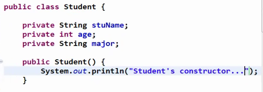
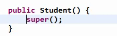
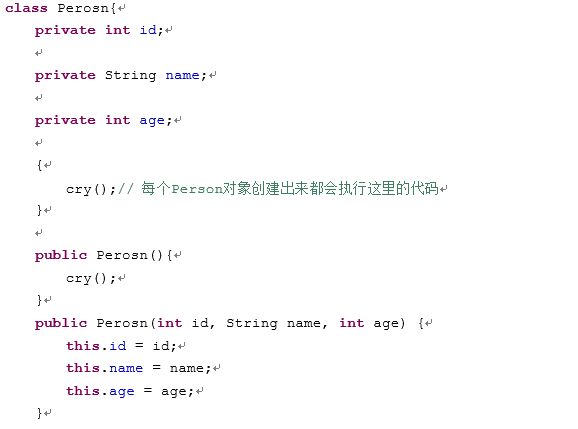
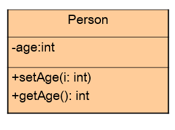

# 构造方法(Constructor)


- 构造器的定义、作用
- 分析对象创建过程内存状态的变化


我们人出生的时候，有些人一出生之后再起名字的，但是有些人一旦出生就已经起好名字的。那么我们在java里面怎么在对象一旦创建就赋值呢？


# 构造器的定义与作用 

在创建对象时,执行的类中的方法

构造方法作用：对对象进行初始化 初始化一些变量

 

构造方法的**特征**

- 它具有与类相同的名称；

  ​	注意名称大小写

- 它不含返回值； 

  ​	注意与返回"void"有区别  没有return语句

在构造方法里不含返回值的概念是不同于“void”的，在定义构造方法时加了“void”，结果这个方法就不再被自动调了。

构造方法的作用：当一个类的实例对象刚产生时，这个类的构造方法就会被自动调用，我们可以在这个方法中加入要完成初始化工作的代码。这就好像我们规定每个“人”一出生就必须先洗澡，我们就可以在“人”的构造方法中加入完成“洗澡”的程序代码，于是每个“人”一出生就会自动完成“洗澡”，程序就不必再在每个人刚出生时一个一个地告诉他们要“洗澡”了。 



**如果不手动定义构造器,则JVM会自动创建一个构造器，如果手动构建了构造器，则JVM不再自动创建**



构造函数与普通的函数的区别

1. 一般函数是用于定义对象应该具备的功能。而构造函数定义的是，对象在调用功能之前，在建立时，应该具备的一些内容,也就是对象的初始化内容。
2. 构造函数是在对象建立时由jvm调用, 给对象初始化。一般函数是对象建立后，当对象调用该功能时才会执行。
3. 普通函数可以使用对象多次调用，构造函数就在创建对象时调用。
4. 构造函数的函数名要与类名一样，而普通的函数只要符合标识符的命名规则即可,不建议和类名一致。
5. 构造函数没有返回值类型，而普通函数没有返回值时需要声明返回void


# 构造器语法

功能：创建类的实例时，初始化实例的一组指令。

语法格式：

< 修饰符> <类名(构造方法名)>([< 参数表>]) {

​	[< 语句>]

} 

举例：

```Java
public class Animal {
    private int legs;
    public Animal() {legs = 4; } //构造器
    public void setLegs(int i) { legs = i; }
    public int getLegs(){return legs;}
}
```

创建Animal类的实例：Animal a=new Animal(); //调用构造器，将legs初始化为4

注释：构造器的名称必须与类名相同。修饰符：public、private、protected

构造器不是方法，没有返回值（连void也不能写）


# 默认的构造方法

Java语言中，每个类都至少有一个构造方法；

如果类的定义者没有显式的定义任何构造方法，系统将自动提供一个默认的构造方法：

默认构造方法没有参数

默认构造方法没有方法体

默认的构造方法：Animal(){}

所以：不编写构造方法就能用new Xxx()创建类的实例。

**Java类中，一旦类的定义者显式定义了一个或多个构造方法，系统将不再提供默认的构造方法；**

构造器的主要作用：利用构造器参数初始化对象的属性 也可以执行一些初始化的方法


# 案例:

三角形类的构造方法,要求传入三条边

并在构造方法中,检测三条边是否满足要求

三角形里有计算面积的成员方法 在main方法中进行调用计算


构造代码块

构造代码块作用：给所有的对象进行统一的初始化。



作用

1：给对象进行初始化。对象一建立就运行并且优先于构造函数。

2：与构造函数区别

- 构造代码块和构造函数的区别，构造代码块是给所有对象进行统一初始化， 构造函数给对应的对象初始化。
- 构造代码块的作用：它的作用就是将所有构造方法中公共的信息进行抽取。

例如孩子一出生统一哭

# 练习

1.  在前面定义的Person类中添加构造方法，利用构造方法设置所有人的age属性初始值都为18。



2. 修改上题中类的构造方法，增加name属性,使得每次创建Person对象的同时初始化对象的age属性值和name属性值。


# 内存分析

Person p = new Person(“Tom”,18) 

的内存状态变化过程分析


# 练习

