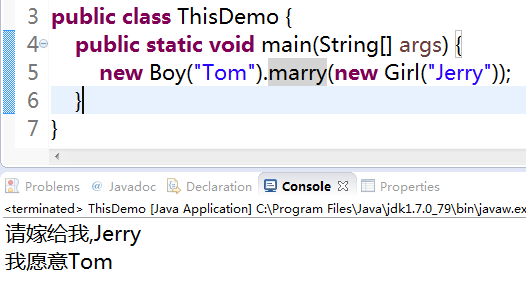

# this关键字

 

案例: 

在getter/setter方法中,使用this关键字 

在构造方法中,使用this关键字 

 

 

 

案例: 

男女表白案例

public void marry(Girl girl){ 

System.out.println(MessageFormat.format("请嫁给我,{0}",girl.getName())); 

        //this是当前类的一个对象的引用,调用当前的方法的对象  

girl.answer("我愿意,"+**this**.getName()); 

} 

 

如果将this对象打印出来...得出啥结果?

案例: 

使用this调用重载的构造器 

public Person() { 

} 

public Person(String name) { 

**this**.name = name; 

} 

public Person(String name, int age) { 

**this**(name); 

**this**.age = age; 

} 

 

 

this的用途: 

1. 在方法中调用当前对象的属性 

2. 在构造方法中调用重载的构造方法 

   1) 注:this必须要放在构造方法的第一行 * 

   2)构造器不能递归调用 

 

 

 

this是什么 

1：在构造函数中打印this 

2：创建对象，打印对象名p 

3：this和p是一样的都是内存地址值。 

4：this代表所在函数所属对象的引用。 

 