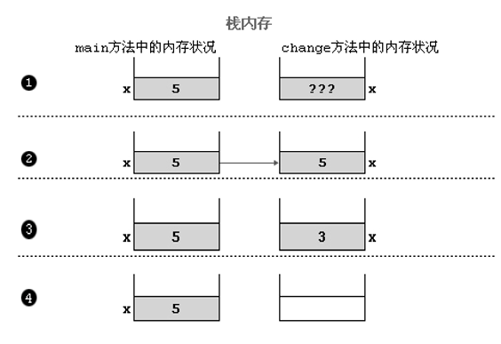
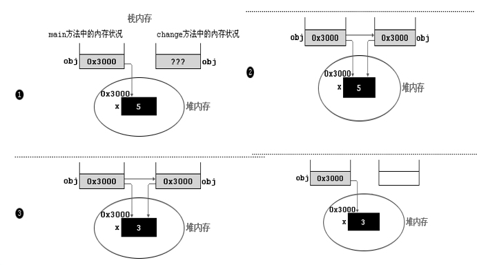
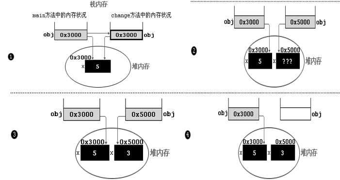

# 函数的参数传递


```Java
public class PassValue {
    public static void main(String[] args) {
        var x = 5;
        var str = "a";
        var o = new Object();
        System.out.println(o);
        change(x);
        change(str);
        System.out.println(x);
        System.out.println(str);
        System.out.println(o);
    }

    private static void change(int x) {
        x = 3;
    }

    private static void change(String y) {
        y = "b";
    }

    private static void change(Object o) {
        o = new Object();
    }

}

```





```Java
public class PassRef {
    public static void main(String[] args) {
        var po = new PassObj();
        po.x = 5;
        change(po);
        System.out.println(po.x);
    }

    private static void change(PassObj po) {
        po.x = 3;
    }

    private static class PassObj {
        public int x;
    }
}
```





```java
public class PassRef {
    public static void main(String[] args) {
        var po = new PassObj();
        po.x = 5;
        change(po);
        System.out.println(po.x);
    }

    private static void change(PassObj po) {
        po = new PassObj();
        po.x = 3;
    }

    private static class PassObj {
        public int x;
    }
}
```


