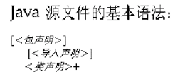
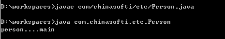
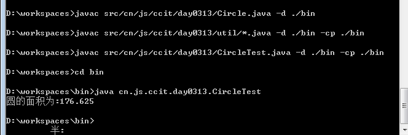

# 源文件布局

源文件布局

在源码目录中，开发软件或者写代码时，需要按模块进行划分，不同的模块应该放在不同的目录下

约定：

​	文件夹需要按域名倒写方式创建，域名文件夹内再包含主模块文件夹，再包含子模块




# 包(package)

为了更好地组织类，Java 提供了包机制，用于区别类名的命名空间。

包和文件夹类似，在java中叫包，在资源管理器中叫文件夹 ,同样，类与文件对应

如包名  com.chinasofti.etc.rg.mail.user

代表   com/chinasofti/etc/rg/mail/user 文件夹

如类  com.chinasofti.etc.rg.mail.user.User

代表   com/chinasofti/etc/rg/mail/user/User.java 文件


- 包帮助管理大型软件系统,将语义近似的类组织到包中。把功能相似或相关的类或接口组织在同一个包中，方便类的查找和使用。
- 包可以包含类和子包。 (类似于文件夹可包含文件和子文件夹),包可以避免名字冲突。
- 包也限定了访问权限，拥有包访问权限的类才能访问某个包中的类。

 

package语句作为Java源文件的第一条语句，指明该文件中定义的类所在的包。(若缺省该语句，则指定为无名包)。它的格式为：

package <顶层包名>[.<子包名>]* ;

举例：pack\Test.java

package p1; //指定类Test属于包p1

public class Test{

public void display(){

System.out.println("in method display()");

}

}


包对应于文件系统的目录，package语句中，用‘ .’ 来指明包(目录)的层次；

包通常用小写单词，类名首字母通常大写。 (包名是标识符 不能是关键字)

 

包名一般由公司的域名倒写开头 接下来再写主模块名.子模块名...

如: 新浪公司开发的java代码

cn.com.sina.mail.send.btn.click





 

 

 

# import语句

 

为使用定义在不同包中的Java类，需用import语句来引入所需要的类。Import语句告诉编译器到哪里去寻找类。

语法格式：

import 包名[.子包名…]. <类名 |*>

 

 

# JDK中主要的包

1.java.lang----包含一些Java语言的核心类，如String、Math、Integer、System和Thread，提供常用功能。

2.java.net----包含执行与网络相关的操作的类。

3.java.io----包含能提供多种输入/输出功能的类。

4.java.util----包含一些实用工具类，如定义系统特性、使用与日期日历相关的函数。


java中规定; java.lang包下的类,不需要手动引入 ( java.lang的子包下的需要)

 

### 静态导入

```java
import static java.lang.System.out;
```

只能导入静态的成员变量   代码中可以直接使用这个成员变量


# 案例

 

在D盘下建 workspaces 目录

workspaces目录下新建源码目录和执行码文件目录  (src , bin)

源码目录下要求以学校的网址命名包和文件夹

模块名写成day0313

在day0313目录下 建一个Circle类 

要求Circle类去调用day0313目录下的util目录下的Calc类下的 clacCircleArea方法

 

在day0313目录下 建一个CircleTest类 用于测试

 

最后将代码执行



```
D:.workspace
├─bin
│  └─cn
│      └─cslg
│          └─day20170809
│              │  Circle.class
│              │  CircleTest.class
│              │
│              └─util
│                      Calc.class
│
└─src
    └─cn
        └─cslg
            └─day20170809
                │  Circle.java
                │  CircleTest.java
                │
                └─util
                        Calc.java
```

