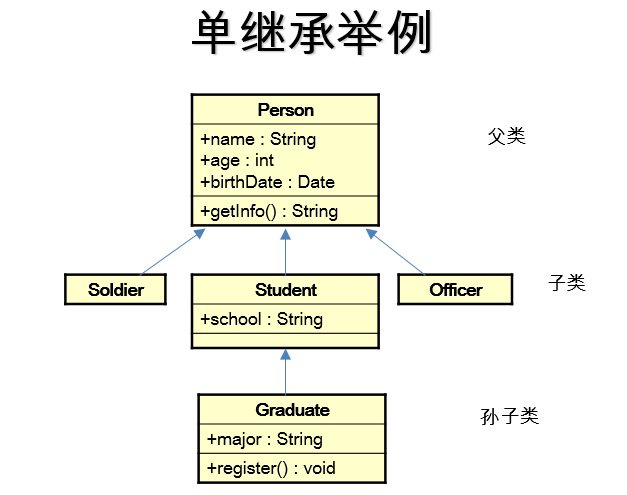
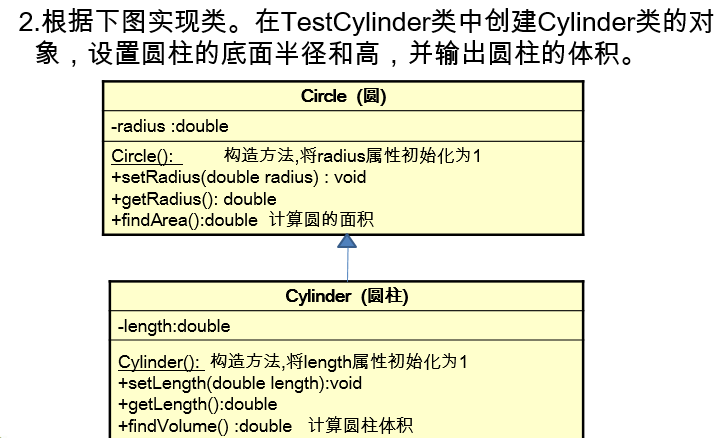

# 类的设计

类与类之间的关系

- 关联关系(has-a)
- 依赖关系(use-a)
- 继承关系(is_a)


# 关联关系

关联关系

– 对象和对象之间的连接。

在Java中，关联关系的代码表现形式为一个类做为另一个类的属性(成员变量)类型存在。

– 即“有”的关系：”has-a”。


案例:

学生和班级


 一对一关联：一个学生，只能在一个班级里学习。

 一对多关联：一个学生，可以参加多个班级学习。

解决一对多的关联的方案

－ 集合 

－ 数组


一对多的案例

- 一只猫有9条命
- 订单和货物
	1. 一条订单信息与货物之间的关系。
	2. 一个订单会有几个货物。
	3. 货物是订单的属性还是方法的参数


单向关联： A类关联B类。 

双向关联：A类关联B类,B类关联A类;

双向关联案例:


双向关联练习:

教师类和学生类    需要考虑一对多或者多对多的关系


## 关联关系的特殊情况

如果两个互相关联的类中有整体和部分的关系，关联关系分为：
**聚合和组合**，主要区别在于生命周期不同。


```java
public class Team {
    private Player player;//运动员
}

class Player {
}
//聚合
//球员与球队之间耦合度较低 可先设立球队,再招募球员,球员全部离职后,球队还在
```


```java
public class Team {
    private Player player = new Player();//运动员
}

class Player {
}
//组合
//球员与球队之间耦合度较高  球队中必须要有一个球员 没有球员时,就不再有球队

```

## 练习

分析淘宝用户与订单。

分析用户与订单之间的关系。

一个用户可以有几个订单，如何在用户信息存储订单信息。


# 依赖

依赖关系(use-a)

指一个类A使用到了另一个类B

依赖关系的特性

这种关系是具有偶然性的、临时性的、非常弱的，但是类B的变化会影响到类A。

依赖具体表现

在代码层面，依赖关系表现为类B作为参数被类A在某个method方法中使用

```Java
public class Person {
    public void travel(Bus bus) {
    }
}

class Bus {
}
```


setter方法一般也要依赖其他的类


## 依赖与关联的区别

 

关联是“HAS”关系，依赖是“USE”关系

A类关联B类，指的是B类对象作为A类的属性存在，称为“has”关系。

A类依赖B类，指的是B的对象作为A类的方法参数存在，称为“use”关系。

 

生命周期不同

如果A类关联B类，那么创建A类的对象时实例化B类的对象，直到A类对象被销毁，所关联的B类对象也被销毁。即只要A类对象存在，B类对象就存在。

如果A类依赖B类，那么只有当A类对象调用到相应方法时，B类对象才被临时创建，方法执行结束，B类对象即被标识为可回收，A类和B类之间的依赖关系是一种瞬时的关系。

## 练习

1.人养宠物

解析：
	1>.分析有几个类；
	2>.类与类之间的关系；	
	3>对于人来说养宠物是人的属性还是方法。	
	4>.对于人来判断，动物是人的属性，还是方法的参数。 


2.人和宠物(使用关联的关系) 

 

3.人上班或者出行需要交通工具。

分析人与交通工具的关系。

 

 

4.创建Cart类，Product类，模拟添加到购物车、查看购物车功能。

5.

需求：使用java描述一个汽车类，汽车具备轮子数、名字、颜色三个属性，还具备跑的功能行为。

需求：使用java描述车与修车厂两个事物，车具备的公共属性：轮子数、名字、颜色，还具备跑的功能行为。跑之前要检测轮子是否少于了4个，如果少于4个，那么要送到修车厂修理，

修车厂修理之后，车的轮子数要补回来4个。然后车就继续的跑起来。

修车厂：具备公共属性 名字、地址、电话。

公共的行为：修车。


# 继承（Inheritance）

继承机制是面向对象程序设计不可缺少的关键概念，是实现软件可重用的根基，是提高软件系统的可扩展性与可维护性的主要途径。

所谓继承是指一个类的定义可以基于另外一个已经存在的类，即子类基于父类，从而**实现父类代码的重用**，子类能吸收已有类的数据属性和行为，并能扩展新的能力。


继承的语法

【访问权限修饰符】【关键字】子类名 extends 父类名{

子类体

 }


```Java
public class Shape {
  public void draw(){}
}
public class Circle extends Shape{
  public double getDiameter(){
  return 0.0;
  }
}

```

继承的作用：代码复用

子类对象可以直接调用父类的属性和方法

```java
public class Shape {
    public void draw(){}
    }
public class Circle extends Shape{
public double getDiameter(){
return 0.0;
}
}
//演示代码：子类对象可以直接调用父类的方法，强调复用性
Circle circle=new Circle();
circle.draw();
```

Java只支持单继承，不允许多重继承

\- 一个子类只能有一个直接父类  除了Ojbect类没有父类，其他的都有

\- 一个父类可以派生出多个子类

 

一个类，直接继承自多个类时，叫多继承   java中不允许多继承




子类继承了父类，就继承了父类的方法和属性（除了private修饰的）。

在子类中，可以使用父类中定义的方法和属性，也可以创建新的数据和方法。

因而，子类通常比父类的功能更多。

在Java 中，继承的关键字用的是“extends”，即子类不仅可以是父类的子集，也可以是对父类的“扩展”。

 JAVA8之后，建议使用继承时，子类作为父类的子集   而扩展的情况可以使用接口进行实现

 

关于继承的规则：

子类不能继承父类中私有的(private)的成员变量和方法。

 

 

 

在JAVA中，大多情况下 父类包含子类 子类是父类的子集   有时 子类也作为父类的扩展




## 练习

1. 创建一个“人”的类，有姓名和年龄，有学生和工人继承这个类，他们也有姓名和年龄。学生有自己的学习方法，

   工人有自己的工作方法。现在有个学生叫张三，22岁，正在学习，有个工人叫李四，25岁，正在工作。

2. （1）定义一个ManKind类，包括
   成员变量int gender和int salary
   方法void manOrWorman()：根据gender的值显示man(gender==l)
   或者"women(gender==0)，
   方法void employeed()：根据salary的值显示"nojob"或者"hired"
   （2）定义类Kid继承ManKind并包括
   成员变量int yearsOld。
   方法printAge()打印yearsOId的值
   （3）在Kid类的main方法中实例化Kid的对象someKid
   该对象访问其父类的成员变量及方法。

3. 分析以下代码的执行结果

```java
public class Example {
 String s = "Outer";
 public static void main(String[] args) {
  S2 s2 = new S2();
  s2.display();
 }
}

class S1 {
 String s = "S1";
 void display() {
  System.out.println(s);
 }
}

class S2 extends S1 {
 String s = "S2";
}
```

