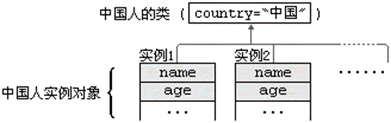
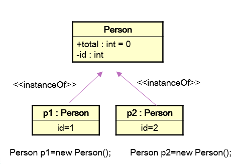
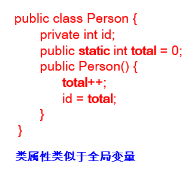

# 关键字

关键词是其含义由编程语言定义的词。 Java关键字和保留字

```java
abstract class    extends implements null      strictfp     true
assert   const    false   import     package   super        try
boolean  continue final   instanceof private   switch       void
break    default  finally int        protected synchronized volatile
byte     do       float   interface  public    this         while
case     double   for     long       return    throw
catch    else     goto    native     short     throws
char     enum     if      new        static    transient
```

# super

在Java类中使用super来引用父类的成分

super可用于访问父类中定义的属性  (非私有)

super可用于调用父类中定义的成员方法  (非私有)

super可用于在子类构造方法中调用父类的构造方法

super的追溯不仅限于直接父类


例子：

```Java
package com.chinasofti.etc.rugao;

public class Person {
    public String name;
    public int age;

    public String getInfo() {
        return "Name: " + name + "\nage: " + age;
    }
}


class Student extends Person {
    private String school = "New Oriental";

    public String getSchool() {
        return school;
    }

    public String getInfo() {
        // 调用父类的方法
        return super.getInfo() + "\nschool: " + school;
    }

    public static void main(String[] args) {
        Student student = new Student();
        student.name = "张海迪";
        student.age = 20;
        student.school = "春田花花";
        System.out.println(student.getInfo());
    }
}
```


## 练习

1.修改类Kids中employed()方法，在该方法中调用父类ManKind的employed()方法，然后再输出“but Kids should study and no job.”

2.修改Cylinder类，在Cylinder类中覆盖findArea()方法，计算圆柱的表面积。考虑：findVolume方法怎样做相应的修改？

在TestCylinder类中创建Cylinder类的对象，设置圆柱的底面半径和高，并输出圆柱的表面积和体积。

附加题：在TestCylinder类中创建一个Circle类的对象，设置圆的半径，计算输出圆的面积。体会父类和子类成员的分别调用。


## 构造方法不能继承

 

子类继承父类所有的成员变量和成员方法（除了私有），但不继承父类的构造方法

在一个Java类中可以通过两种方式获得构造方法

使用系统默认的无参数构造方法

显式定义一个或多个构造方法

一旦显式定义了构造方法，则系统不再提供默认构造方法

## 调用父类构造方法

在子类的构造方法中可使用super(参数列表)语句调用父类的构造方法

如果子类的构造方法中没有显式地调用父类构造方法，也没有使用this关键字调用重载的其它构造方法，则系统默认调用父类无参数的构造方法 代码执行时，先调用父类的构造方法，再调用子类的构造方法

如果子类构造方法中既未显式调用父类构造方法，而父类中又没有无参的构造方法，则编译出错

```Java
package com.chinasofti.etc.rugao;

import java.util.Date;

public class Person {

    private String name;
    private int age;
    private Date birthDate;

    public Person(String name, int age, Date d) {
        this.name = name;
        this.age = age;
        this.birthDate = d;
    }

    public Person(String name, int age) {
        this(name, age, null);
    }

    public Person(String name, Date d) {
        this(name, 30, d);
    }

    public Person(String name) {
        this(name, 30);
    }
// ……
}


public class Student extends Person {
    private String school;

    public Student(String name, int age, String s) {
        super(name, age);
        school = s;
    }

    public Student(String name, String s) {
        super(name);
        school = s;
    }

    public Student(String s) {
        // 编译出错: 
        school = s;
    }
}
```


# static

## 静态成员变量

当我们编写一个类时，其实就是在描述其对象的属性和行为，而并没有产生实质上的对象，只有通过new关键字才会产生出对象，这时系统才会分配内存空间给对象，其方法才可以供外部调用。我们有时候希望无论是否产生了对象或无论产生了多少对象的情况下，某些特定的数据在内存空间里只有一份，例如所有的中国人都有个国家名称，每一个中国人都共享这个国家名称，不必在每一个中国人的实例对象中都单独分配一个用于代表国家名称的变量。




```java
class Circle
{
private double radius;
public Circle(double radius){this.radius=radius;}
public double findArea(){return Math.PI*radius*radius;}
}
创建两个Circle对象
Circle c1=new Circle(2.0); //c1.radius=2.0
Circle c2=new Circle(3.0); //c2.radius=3.0
```

Circle类中的变量radius是一个实例变量(instance variable)，它属于类的每一个对象，不能被同一个类的不同对象所共享。

上例中c1的radius独立于c2的radius，存储在不同的空间。c1中的radius变化不会影响c2的radius，反之亦然

在Java类中声明**变量、方法**和**内部类**时，可使用关键字static做为修饰符


static标记的变量或方法由整个类(所有实例)共享，如访问控制权限允许，可不必创建该类对象而直接用类名加‘.’调用。

## 练习：

创建类Cicle，在Cicle类中创建静态成员变量PI，所有的圆对象都共享PI，并创建getArea方法用于计算面积

创建多个对象，修改PI测试，体会静态成员变量的作用


static成员也称类成员或静态成员，如：类变量、类方法、静态方法等。


类变量（类属性）由该类的所有实例共享





```java
class Person {
           private int id;
           public static int total = 0;
           public Person() {
           total++;
           id = total;
           }
           public static void main(String args[]){
          Person Tom=new Person()
Tom.id=0;
total=100; // 不用创建对象就可以访问静态成员
         }
 }

public class OtherClass {
            public static void main(String args[]) {
           Person.total = 100;  // 不用创建对象就可以访问静态成员
                           //访问方式：类名.类属性类名.类方法
         System.out.println(Person.total);
         Person c = new Person(); 
         System.out.println(c.total); //输出?
            }
}
```


## 静态方法(Static Method)

没有对象的实例时，可以用类名.方法名()的形式访问由static标记的类方法

```java
class Person {
       private int id;
       private static int total = 0;
       public static int getTotalPerson() { 
return total;
       }
       public Person() {
          total++;
  id = total;
       }
}
public class TestPerson {
        public static void main(String[] args) {
  System.out.println("Number of total is " +Person.getTotalPerson());
```

在static方法内部只能访问类的static属性，不能访问类的非static属性。


```java
class Person {
       private int id;
       private static int total = 0;
       public static int getTotalPerson() { 
id++; //非法
return total;
       }
       public Person() {
          total++;
  id = total;
       }
}
```

**因为不需要实例就可以访问static方法，因此static方法内部不能有this,也不能有super ?** 

```java
class Person {
       private int id;
       private static int total = 0;
       public static void setTotalPerson(int total){
        this.total=total;    //非法，在static方法中不能有this，也不能有super
       }
      public Person() {
          total++;
  id = total;
       }
}
public class TestPerson {
        public static void main(String[] args) {
  Person.setTotalPerson();
        }
}
```

在静态方法里只能直接调用同类中其它的静态成员（包括属性和方法），而不能直接访问类中的非静态成员（包括属性和方法）。这是因为，对于非静态的方法和变量，需要先创建类的实例对象后才可使用，而静态方法在使用前不用创建任何对象。

静态方法不能以任何方式引用this和super关键字。与上面的道理一样，因为静态方法在使用前不用创建任何实例对象，当静态方法被调用时，this所引用的对象根本就没有产生。

main() 方法是静态的，因此JVM在执行main方法时不创建main方法所在的类的实例对象，因而在main()方法中，我们不能直接访问该类中的非静态成员，必须创建该类的一个实例对象后，才能通过这个对象去访问类中的非静态成员，这种情况，我们在以后的例子中会多次碰到。


 

 

## 类属性、类方法的设计思想

 

类属性作为该类各个对象之间共享的变量。在设计类时,分析哪些类属性不因对象的不同而改变，将这些属性设置为类属性。相应的方法设置为类方法。

如果方法与调用者无关，则这样的方法通常被声明为类方法，由于不需要创建对象就可以调用类方法，从而简化了方法的调用


## 练习

编写一个类，实现银行账户的概念，包含的属性有“帐号”、“密码”、“存款余额”、“利率”、“最小余额”，定义类封装这些属性的方法。账号要自动生成。

编写主类，使用银行账户类，输入、输出3个储户的上述信息。

考虑：哪些属性可以设计成static属性。 Bank.java

